# 📋 Form Evaluasi Tugas Besar Pemrograman Lanjut

## 🎯 **Pengembangan Aplikasi Situs Web Counselor Hub**
### *Sebagai Platform Layanan Konseling Daring*

---

### 👥 **Tim Pengembang**
| Nama | NIM | Role |
|------|-----|------|
| **Pandu Kaya Hakiki** | 1103220016 | Full-Stack Developer |
| **Adhiaris Muhammad Azka** | 1103220143 | Backend Developer |

---

---

## 📋 **Keterangan Singkat Tugas Besar**

### 🎯 **Project Overview**

### a. Deskripsi Tugas Besar
Counselor Hub adalah platform layanan konseling daring terintegrasi yang dirancang khusus untuk lingkungan pendidikan. Aplikasi ini mengombinasikan teknologi web modern dengan metodologi psikologi terkini untuk menyediakan sistem manajemen konseling yang komprehensif.

**Fitur Utama:**
- **Sistem Manajemen Siswa**: Pengelolaan profil siswa dengan sistem user management terintegrasi
- **Penilaian Kesehatan Mental**: Implementasi tes psikologi standar (PHQ-9, GAD-7, DASS-21) dengan analisis otomatis
- **Penilaian Karir**: Tes RIASEC (Holland Code) dan MBTI untuk rekomendasi jalur karir
- **Manajemen Sesi Konseling**: Sistem penjadwalan, dokumentasi, dan persetujuan sesi konseling
- **Analytics & Reporting**: Dashboard analitik untuk monitoring progress siswa
- **Multi-role Access**: Support untuk admin, konselor, dan siswa dengan hak akses berbeda
- **Responsive Design**: Interface yang optimal untuk desktop dan mobile

### b. Pengguna
1. **Administrator**: Mengelola sistem secara keseluruhan, manajemen user, dan konfigurasi aplikasi
2. **Konselor**: Melakukan penilaian, sesi konseling, monitoring kesehatan mental siswa
3. **Siswa**: Mengakses tes psikologi, melihat hasil assessment, dan menjadwalkan konseling
4. **Staff Pendidikan**: Viewing access untuk data siswa sesuai kewenangan

### c. Manfaat Pengguna
**Untuk Siswa:**
- Akses mudah ke layanan konseling dan penilaian kesehatan mental
- Hasil assessment real-time dengan rekomendasi tindak lanjut
- Tracking progress personal dalam kesehatan mental dan pengembangan karir
- Platform aman untuk konsultasi dengan konselor profesional

**Untuk Konselor:**
- Tools assessment digital yang terstandarisasi dan terintegrasi
- Sistem dokumentasi sesi konseling yang lengkap dan terstruktur
- Dashboard monitoring untuk tracking progress multiple siswa
- Analytics untuk identifikasi tren dan pattern dalam kesehatan mental siswa

**Untuk Administrator:**
- Manajemen komprehensif seluruh aspek sistem
- Reporting dan analytics untuk decision making
- Control system security dan user access management
- Overview sistemik tentang kondisi kesehatan mental institusi

---

## 📊 **Komponen Nilai**

### 💻 **Codebase Analysis**

### a. 📈 **Jumlah Baris**
**Backend Python:**
- **app.py** (Main API server): 4,512 baris 🐍
- **create_counselorhub_database.py** (Database setup): 580 baris 🗄️
- **image_service.py** (Image upload service): 199 baris 🖼️
- **Routes modules** (app/routes/*.py): 9 files (struktur modular) 📁
- **Total Backend**: **5,291 baris** ✅

**Database:**
- **counselorhub.sql** (Schema & data): 453 baris 🗃️

**Frontend:**
- **src folder** (React/TypeScript): 29,722 baris ⚛️

**Total Keseluruhan**: **35,466 baris kode** 🎯

### b. 🐍 **Nama-nama Modul Python**
Berdasarkan analisis file backend dan `requirements.txt`:

**Backend Files & Modules:**

**Core Application Files:**
- `app.py` (4,512 baris) - Main Flask API server dengan 50+ endpoints
- `create_counselorhub_database.py` (580 baris) - Database schema creation dan sample data
- `image_service.py` (199 baris) - Image upload dan processing service

**Core Framework:**
- `flask` (v3.0.0) - Web framework utama
- `flask-cors` (v4.0.0) - Cross-Origin Resource Sharing

**Database & Data Management:**
- `mysql-connector-python` (v9.0.0) - MySQL database connector
- `bcrypt` (v4.1.2) - Password hashing dan security

**Image Processing:**
- `Pillow` (v10.1.0) - Image processing dan manipulation
- `image_service` (custom module) - Service untuk handling gambar

**Built-in Python Modules:**
- `uuid` - Generating unique identifiers
- `datetime`, `date` - Date and time handling
- `json` - JSON data processing
- `logging` - Application logging
- `os` - Operating system interface
- `time` - Time-related functions

### c. ⚙️ **Fungsi-fungsi Utama Backend**

#### **🏗️ Backend Core Files Functions:**

**1. 🖥️ app.py (4,512 baris) - Main API Server:**

**👥 User Management Functions:**
- `get_users()` - Mengambil semua user aktif dengan filtering
- `create_user()` - Membuat user baru dengan validasi dan auto-generate user ID
- `update_user()` - Update data user existing
- `delete_user()` - Soft delete user (set is_active = False)
- `login()` - Autentikasi user dengan bcrypt password verification

**🎓 Student Management Functions:**
- `get_students()` - Mengambil data siswa dengan filtering dan pagination
- `create_student()` - Membuat profile siswa baru dengan foreign key ke users table
- `update_student()` - Update data akademik dan personal siswa
- `delete_student()` - Soft delete siswa
- `get_student_by_user_id()` - Mapping user ID ke student ID
- `create_students_batch()` - Bulk creation siswa dari import data

**🏫 Class Management Functions:**
- `get_classes()` - Mengambil data kelas dengan filtering
- `create_class()` - Membuat kelas baru dengan auto-generate class ID
- `update_class()` - Update informasi kelas
- `delete_class()` - Soft delete kelas
- `get_class_students()` - Mengambil siswa dalam kelas tertentu

**🧠 Mental Health Assessment Functions:**
- `get_mental_health_assessments()` - Mengambil data assessment dengan filtering
- `create_mental_health_assessment()` - Menyimpan hasil tes psikologi (PHQ-9, GAD-7, DASS-21)
- `update_mental_health_assessment()` - Update hasil assessment
- `delete_mental_health_assessment()` - Hapus assessment
- `get_mental_health_trends()` - Analytics tren kesehatan mental siswa

**💼 Career Assessment Functions:**
- `get_career_assessments()` - Mengambil data penilaian karir
- `create_career_assessment()` - Menyimpan hasil RIASEC dan MBTI
- `get_career_resources()` - Resource dan materi pengembangan karir
- `create_career_resource()` - Tambah resource karir baru

**💬 Counseling Session Functions:**
- `get_counseling_sessions()` - Mengambil data sesi konseling dengan filtering
- `create_counseling_session()` - Membuat sesi konseling baru dengan auto-generate session ID
- `update_counseling_session()` - Update dokumentasi sesi
- `delete_counseling_session()` - Soft delete sesi
- `approve_counseling_session()` - Approval workflow untuk sesi
- `reject_counseling_session()` - Reject sesi dengan alasan
- `get_counseling_analytics()` - Analytics sesi konseling per siswa

**👨‍💼 Admin Functions:**
- `get_deleted_students()` - Manage siswa yang dihapus
- `restore_student()` - Restore siswa yang dihapus
- `hard_delete_student()` - Permanent delete siswa
- `bulk_hard_delete_students()` - Bulk permanent delete
- `get_deleted_users()` - Manage user yang dihapus
- `get_deleted_classes()` - Manage kelas yang dihapus

**🔧 Utility Functions:**
- `get_db_connection()` - Database connection management
- `dict_factory()` - Convert MySQL row ke dictionary
- `health_check()` - Endpoint untuk health monitoring
- `get_counselors()` - Mengambil daftar konselor aktif

**2. 🗄️ create_counselorhub_database.py (580 baris) - Database Setup:**
- `create_database_connection()` - Establish MySQL connection
- `create_database()` - Create CounselorHub database
- `create_tables()` - Create all database tables with relationships
- `insert_sample_data()` - Insert comprehensive sample data
- `create_database_user()` - Setup database user with proper permissions
- `show_database_info()` - Display database configuration info
- `main()` - Main execution function

**3. 🖼️ image_service.py (199 baris) - Image Processing Service:**
- `ImageUploadService.__init__()` - Initialize upload service configuration
- `validate_file()` - Validate uploaded files (type, size, format)
- `save_uploaded_file()` - Save file to filesystem with secure naming
- `create_thumbnails()` - Generate multiple size thumbnails
- `get_image_url()` - Generate public URL for images
- `delete_image()` - Remove image and thumbnails from filesystem
- `list_images()` - List all uploaded images with metadata
- `optimize_image()` - Compress and optimize image files

### d. 🎨 **Output**

**Frontend (React/TypeScript) - 112 files:** ⚛️
- **74 React Components (.tsx)** - UI components dan pages
- **38 TypeScript Modules (.ts)** - Services, utilities, types, configs
- **49 Main Components** di folder components/ meliputi:
  - Assessment tools (MbtiAssessment, RiasecAssessment, IntegratedMentalHealthTestPage)
  - Management interfaces (StudentsPage, ClassesPage, SessionsPage)
  - Dashboard dan analytics components
  - User interface components (Login, Profile, Settings)
- **Responsive Web Application** dengan modern UI/UX design menggunakan Tailwind CSS
- **Multi-page SPA** dengan routing dinamis
- **Real-time Dashboard** dengan charts dan analytics
- **Interactive Assessment Tools** (PHQ-9, GAD-7, DASS-21, RIASEC, MBTI)
- **Counseling Session Management Interface**
- **Student Profile Management**
- **Role-based Access Control Interface**

**Backend (Python Flask) - 3 core files + 9 route modules:**
- **Main API Server (app.py)** dengan 50+ REST endpoints
- **Database Setup Script** dengan automated schema creation
- **Image Processing Service** dengan thumbnail generation
- **Modular Route Architecture** untuk better code organization
- **MySQL Database Integration** dengan normalized schema
- **Authentication & Authorization System**
- **File Upload & Image Processing**
- **Session Management & Security**
- **Comprehensive Logging System**

**Key Features Implemented:**
1. **Assessment Engine**: Automated scoring dan interpretation untuk tes psikologi
2. **Workflow Management**: Approval system untuk sesi konseling
3. **Analytics Dashboard**: Real-time charts dan trends analysis
4. **Multi-language Support**: Internationalization dengan React i18next
5. **Data Security**: Bcrypt password hashing, input validation, SQL injection prevention
6. **Scalable Architecture**: Modular design dengan separation of concerns

**Database Schema (9 Tables):**

**Core Entity Tables:**
1. **users** - User authentication dan role management (admin, counselor, student)
2. **students** - Profile siswa dengan academic information dan foreign key ke users
3. **classes** - Manajemen kelas dengan grade level dan academic year tracking
4. **counselors** - Profile konselor dengan specialization dan license information

**Assessment & Testing Tables:**
5. **mental_health_assessments** - Hasil tes psikologi (PHQ-9, GAD-7, DASS-21) dengan scoring otomatis
6. **career_assessments** - Hasil tes karir (RIASEC, MBTI) dengan career recommendations

**Session Management Tables:**
7. **counseling_sessions** - Dokumentasi sesi konseling dengan approval workflow
8. **session_notes** - Detailed notes dan progress tracking per sesi

**Support Tables:**
9. **career_resources** - Repository materi pengembangan karir dan guidance resources

**Database Features:**
- **Foreign Key Relationships**: Normalized schema dengan referential integrity
- **Soft Delete Implementation**: Data recovery capability untuk semua entity
- **Optimized Indexing**: Performance optimization untuk complex queries
- **Audit Trail**: Timestamp tracking untuk created_at dan updated_at
- **Data Security**: Encrypted sensitive data dengan proper access control

**Technical Achievements:**
- **Full-stack Integration**: Seamless frontend-backend communication
- **State Management**: Context API untuk global state
- **Error Handling**: Comprehensive error management di semua layer
- **Performance Optimization**: Lazy loading, pagination, caching
- **Mobile Responsive**: Optimal experience across devices
- **Code Quality**: TypeScript type safety, ESLint, modular architecture

---

## 📊 **Project Statistics Summary**

| 📈 **Metric** | 📋 **Details** | 📊 **Count** |
|---------------|---------------|-------------|
| 💻 **Total Lines of Code** | Entire Project | **35,466** |
| 🐍 **Backend Python** | Flask API + Services | **5,291** |
| ⚛️ **Frontend React/TS** | Components + Services | **29,722** |
| 🗄️ **Database Schema** | SQL Scripts | **453** |
| 🔧 **API Endpoints** | REST API Functions | **50+** |
| 📱 **React Components** | UI Components | **74** |
| 🏗️ **Database Tables** | Normalized Schema | **9** |
| 👥 **User Roles** | Access Control | **4** |

---

## 🏆 **Technical Excellence Highlights**

### 🔒 **Security Features**

### 🎨 **Frontend Technologies**

### 🛠️ **Backend Technologies**

### 📊 **Assessment Tools**

---

## 🎯 **Project Architecture Overview**

```mermaid
graph TB
    A[🌐 Frontend React/TypeScript] --> B[🔄 REST API Layer]
    B --> C[🐍 Flask Backend]
    C --> D[🗄️ MySQL Database]
    
    subgraph "Frontend Layer"
        A1[📱 74 React Components]
        A2[🎨 Tailwind CSS]
        A3[🌍 Multi-language Support]
    end
    
    subgraph "Backend Layer"
        C1[🔐 Authentication System]
        C2[📊 Assessment Engine]
        C3[📝 Session Management]
        C4[🖼️ Image Processing]
    end
    
    subgraph "Database Layer"
        D1[👥 User Management]
        D2[📋 Student Profiles]
        D3[🧠 Mental Health Data]
        D4[💼 Career Assessments]
    end
    
    A --> A1
    A --> A2
    A --> A3
    C --> C1
    C --> C2
    C --> C3
    C --> C4
    D --> D1
    D --> D2
    D --> D3
    D --> D4
```

---

## 🚀 **Key Features Demonstration**

### 🧠 **Mental Health Assessment Tools**
| Tool | Purpose | Implementation |
|------|---------|----------------|
| 🔴 **PHQ-9** | Depression Screening | Automated scoring with severity levels |
| 🟠 **GAD-7** | Anxiety Assessment | Real-time risk evaluation |
| 🟡 **DASS-21** | Comprehensive Mental Health | Multi-dimensional analysis |

### 💼 **Career Development Tools**
| Tool | Purpose | Implementation |
|------|---------|----------------|
| 🟢 **RIASEC** | Holland Career Code | Personality-career matching |
| 🔵 **MBTI** | Personality Assessment | 16-type personality analysis |

### 📊 **Analytics & Reporting**
- 📈 **Real-time Dashboard** with interactive charts
- 📋 **Progress Tracking** for individual students
- 🎯 **Trend Analysis** for institutional insights
- 📱 **Mobile-responsive** interface design

---

## 👨‍💻 **Development Team Credits**

| 👤 **Developer** | 🎯 **Role** | 🛠️ **Contributions** |
|------------------|-------------|----------------------|
| **Pandu Kaya Hakiki** | Full-Stack Developer | Frontend React Components, Backend API, Database Design, System Architecture |
| **Adhiaris Muhammad Azka** | Backend Developer | Backend API Development, Database Integration, Server-side Logic |

### 🎓 **Academic Information**
**Course**: Pemrograman Lanjut  
**Institution**: Telkom University
**Semester**: 6

---

## ✨ **Project Completion Status**

**🎉 Total Development Time**: 2 Bulan 
**📊 Final Codebase**: 35,466+ lines across multiple technologies  
**🏆 Achievement**: Full-featured mental health counseling platform

---

*📝 Dokumen ini menggambarkan implementasi lengkap dari sistem **Counselor Hub** sebagai platform konseling daring modern yang menggabungkan teknologi web terdepan dengan metodologi psikologi profesional untuk mendukung kesehatan mental di lingkungan pendidikan.*

